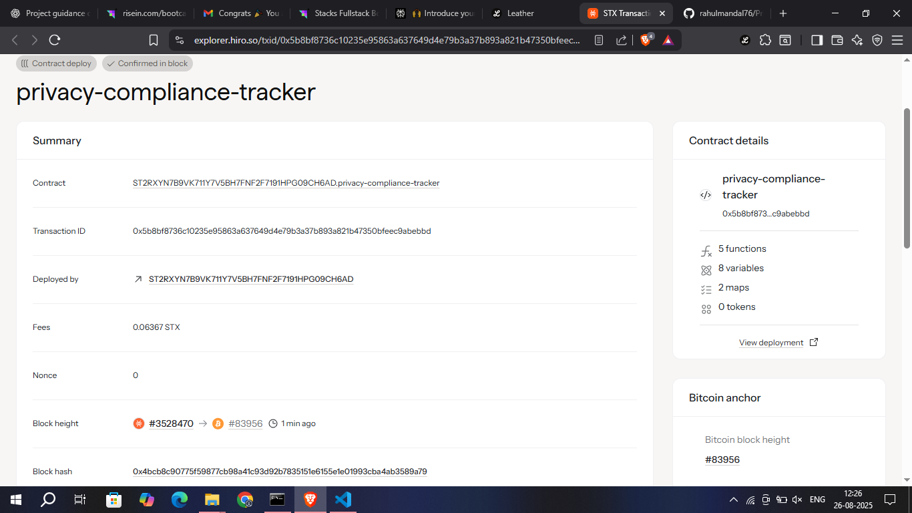

# PrivacyCompliance Tracker

## Project Description

The PrivacyCompliance Tracker is a blockchain-based smart contract system designed to automate GDPR (General Data Protection Regulation) and privacy regulation compliance monitoring. This decentralized solution enables organizations to register their data processing activities, track compliance status, and undergo automated verification processes while maintaining transparency and immutability of compliance records.

The system provides a trustless environment where entities can demonstrate their commitment to data privacy regulations, undergo compliance audits, and maintain verifiable records of their privacy practices. By leveraging blockchain technology, the tracker ensures that compliance data cannot be tampered with and provides a transparent audit trail for regulatory authorities and stakeholders.

## Project Vision

Our vision is to revolutionize privacy compliance management by creating a decentralized, transparent, and automated system that:

- **Democratizes Compliance**: Makes GDPR compliance tracking accessible to organizations of all sizes
- **Ensures Transparency**: Provides immutable records of compliance activities that can be verified by anyone
- **Reduces Bureaucracy**: Automates compliance verification processes, reducing manual oversight and paperwork
- **Builds Trust**: Creates a trustless system where stakeholders can verify compliance status without relying on centralized authorities
- **Promotes Privacy**: Encourages better data protection practices through gamified compliance scoring
- **Facilitates Regulation**: Provides regulators with real-time, verifiable compliance data

The ultimate goal is to create a global standard for privacy compliance tracking that protects individual privacy rights while enabling businesses to operate with confidence in their compliance status.

## Future Scope

### Phase 1: Core Enhancement
- **Multi-Regulatory Support**: Extend beyond GDPR to include CCPA, PIPEDA, and other regional privacy laws
- **Advanced Scoring Algorithm**: Implement machine learning-based compliance scoring with weighted criteria
- **Automated Alerts**: Real-time notifications for compliance deadlines and audit requirements
- **Integration APIs**: REST APIs for seamless integration with existing compliance management systems

### Phase 2: Advanced Features
- **Smart Contract Automation**: Automated compliance actions based on predefined triggers
- **Cross-Chain Compatibility**: Support for multiple blockchain networks
- **Privacy-Preserving Analytics**: Zero-knowledge proofs for sensitive compliance data
- **Decentralized Governance**: Community-driven updates and compliance standard modifications
- **Compliance Marketplace**: Platform for compliance service providers and auditors

### Phase 3: Enterprise Solutions
- **Enterprise Dashboard**: Comprehensive web interface for compliance management
- **Batch Processing**: Support for large-scale entity registration and audit processes
- **Custom Compliance Templates**: Industry-specific compliance frameworks
- **Regulatory Reporting**: Automated generation of regulatory reports
- **Compliance Insurance**: Integration with insurance providers for compliance-based coverage

### Phase 4: Global Ecosystem
- **International Standards**: Alignment with global privacy regulation frameworks
- **Government Integration**: Direct integration with regulatory authority systems
- **Educational Platform**: Training and certification programs for privacy compliance
- **Research Analytics**: Anonymized compliance trend analysis for policy development
- **Mobile Applications**: Mobile-first compliance management for small businesses

## Contract Address Details

Contract ID: ST2RXYN7B9VK711Y7V5BH7FNF2F7191HPG09CH6AD.privacy-compliance-tracker

**Mainnet Deployment:**
- Contract Address: `[To be added]`
- Transaction Hash: `[To be added]`
- Block Number: `[To be added]`
- Gas Used: `[To be added]`

**Testnet Deployment:**
- Contract Address: `[To be added]`
- Network: `[To be specified]`
- Transaction Hash: `[To be added]`
- Block Number: `[To be added]`

**Contract Verification:**
- Source Code Verified: `[To be confirmed]`
- Compiler Version: `[To be added]`
- Optimization: `[To be specified]`

---

## Getting Started

### Prerequisites
- Clarity CLI tools
- Stacks blockchain access
- Basic understanding of GDPR requirements

### Deployment
1. Clone the repository
2. Install dependencies
3. Deploy to testnet for testing
4. Deploy to mainnet for production use

### Usage
1. **Register Entity**: Call `register-entity-compliance` with your organization's details
2. **Conduct Audit**: Authorized auditors can call `conduct-compliance-audit`
3. **Check Status**: Use read-only functions to query compliance records

### Contributing
We welcome contributions! Please read our contributing guidelines and submit pull requests for any improvements.

### License
This project is licensed under the MIT License - see the LICENSE file for details.

### Support
For support and questions, please open an issue on our GitHub repository or contact our development team.